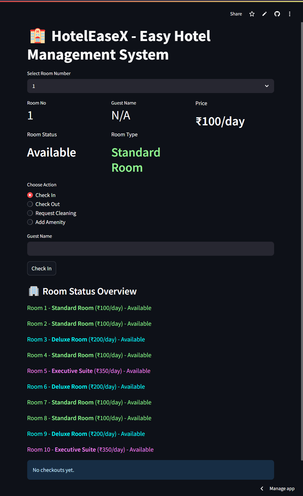
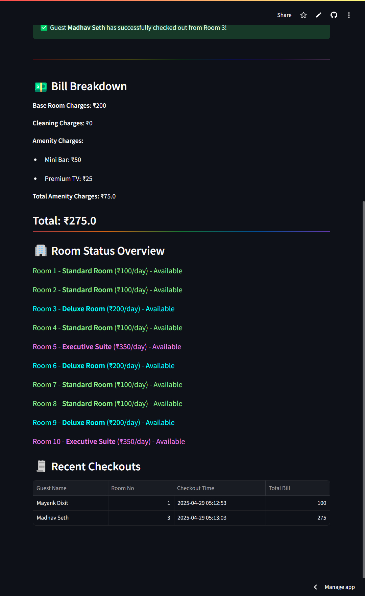

# 🏨 HotelEaseX - Easy Hotel Management System

HotelEaseX is a user-friendly hotel management system built with Python and Streamlit, designed to streamline hotel operations such as check-in, check-out, room cleaning, and amenity management. It supports different room types (Standard, Deluxe, and Executive Suite) with dynamic billing and a clean, interactive interface.

## Features

- **Room Management**: Manage check-in/check-out, room availability, and guest details.

- **Multiple Room Types**:

- Standard Room: ₹100/day

- Deluxe Room: ₹200/day (with amenities like Mini Bar and Premium TV)

- Executive Suite: ₹350/day (with premium amenities like Jacuzzi and Personal Butler)

- **Billing System**: Automatically calculates bills based on room rates, cleaning fees, and amenities.

- **Cleaning Service**: Request cleaning for rooms with associated fees.

- **Amenity Management**: Add custom amenities to Deluxe Rooms and Executive Suites.

- **Checkout History**: Tracks recent checkouts with guest details and bill breakdowns.

- **Responsive UI**: Built with Streamlit for an intuitive and interactive experience.

## Demo

Try the live demo: [HotelEaseX on Streamlit](https://hotel-ease-x.streamlit.app/)

## Installation

To run HotelEaseX locally, follow these steps:

1.  **Clone the Repository**:

```bash

git clone https://github.com/sharifmdathar/hotel-ease-x.git

cd hotel-ease-x

```

2.  **Install Dependencies**:

Ensure you have Python 3.8+ installed. Then, install the required packages:

```bash

pip install streamlit

```

3.  **Run the Application**:

Start the Streamlit app:

```bash

streamlit run streamlit_app.py

```

4.  **Access the App**:

Open your browser and navigate to `http://localhost:8501`.

## Project Structure

- `streamlit_app.py`: Main application file containing the Streamlit frontend and logic.

- `hotel_system.py`: Backend logic for hotel, room types, billing, cleaning, and amenity management.

- `requirements.txt`: Lists Python dependencies (Streamlit, etc.).

## Usage

1.  **Select a Room**: Choose a room number from the dropdown.

2.  **View Room Details**: Check room status, type, guest name, and price.

3.  **Perform Actions**:

- **Check In**: Enter a guest name to check into an available room.

- **Check Out**: Check out a guest and view the bill breakdown.

- **Request Cleaning**: Clean a room for a fee if it's not already clean.

- **Add Amenity**: Add custom amenities to Deluxe Rooms or Executive Suites.

4.  **Monitor Status**: View the status of all rooms and recent checkouts in the overview section.

## Screenshots

_Main Interface_


_Checkout Bill Breakdown and Checkout History_


## Contributing

Contributions are welcome! To contribute:

1. Fork the repository.

2. Create a new branch (`git checkout -b feature-branch`).

3. Make your changes and commit (`git commit -m "Add feature"`).

4. Push to the branch (`git push origin feature-branch`).

5. Open a Pull Request.

## License

This project is licensed under the MIT License. See the [LICENSE](LICENSE) file for details.

## Contact

For questions or feedback, reach out via the [GitHub Issues](https://github.com/sharifmdathar/hotel-ease-x/issues) page or contact the maintainer at [sharifmdathar](https://github.com/sharifmdathar).

---

Built with ❤️ using Streamlit and Python.
